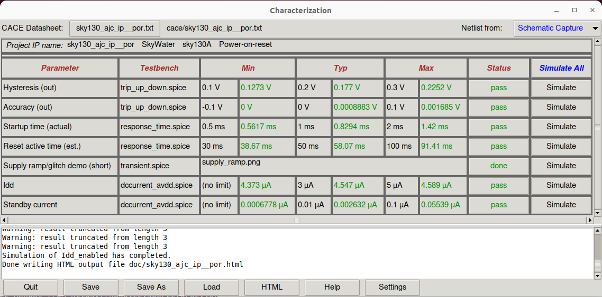
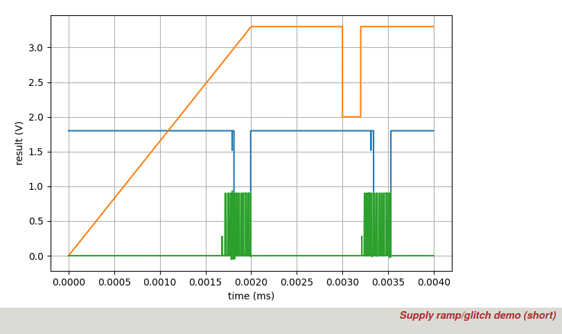
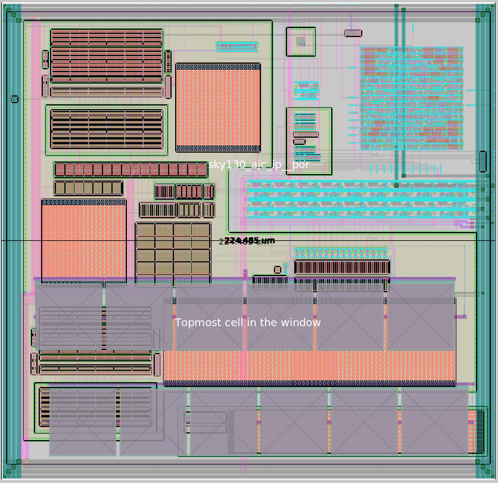
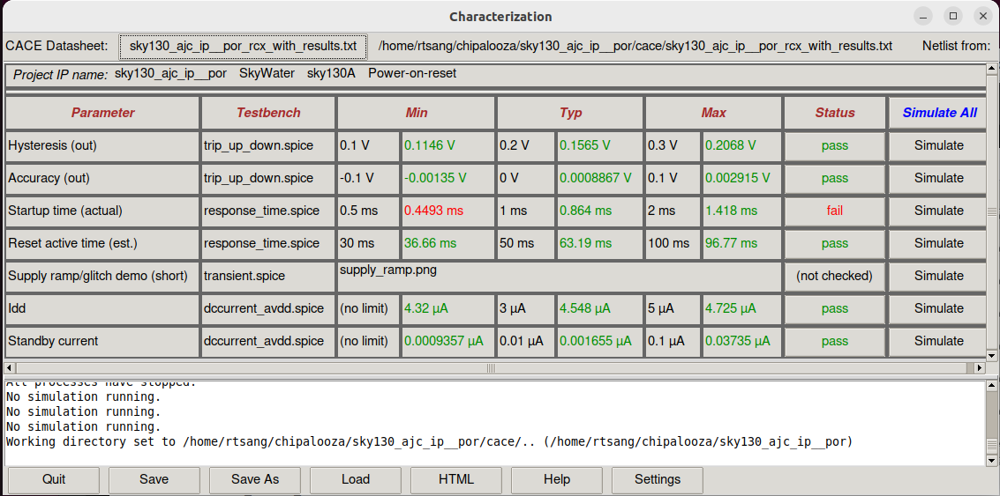
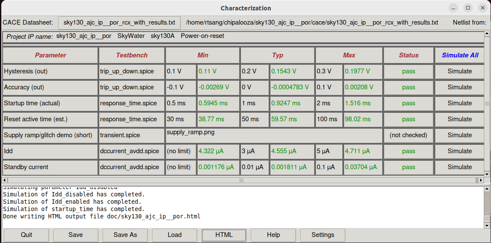
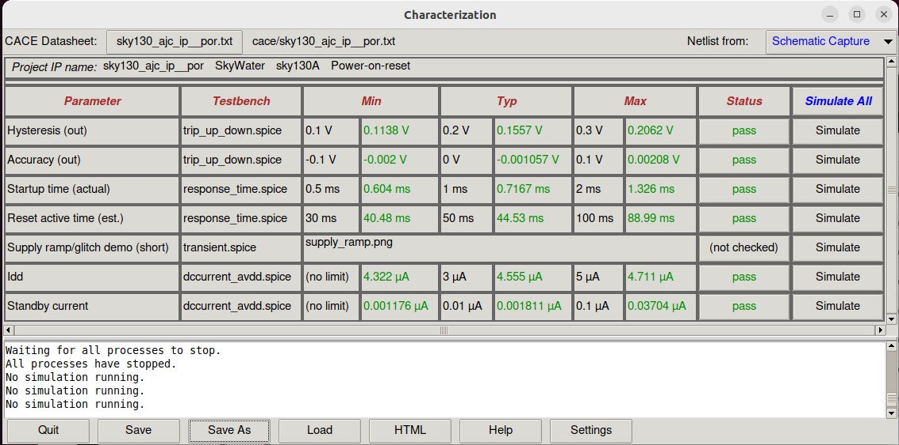

# sky130_ajc_ip__por
Power-on-reset (POR) bandgap-type for SKY130

This circuit is designed to produce a reset signal for chip/system-wide reset at power-up or after a supply collapes and subsequently recovers.  A selectable trip voltage from 2.4V to 3.0V sets the voltage at which the power supply is considered good, after which a one-shot timer, roughly 1ms in duration, allows the supply to stabilize.  A the system wide reset signal `por` is then asserted, and a second one-shot timer times a nominally 50ms reset window. 

The reset signal comes in three flavors, each capable of driving a 20pF load, `por` (active high 1v8) `porb` (active low 1v8) and `porb_h` (active low 3v3).

The trip voltage is set via `otrip[2:0]`

To clone this repository:

`git clone https://github.com/ajcci/sky130_ajc_ip__por`

To view a schematic after cloning the repository:

```
cd sky130_ajc_ip__por
xschem cace/dccurrent_avdd.sch
```

Run CACE to see simulation results against a set of specifications:

`cace-gui`


Results from before layout started.


Demo of a supply ramp on `avdd` (orange), causing the `porb` (blue) to assert a reset.  The green trace is `osc_ck`, the internal clock that times the one-shot timer window.  Due to long simulation times, both one-shot timers are significantly shortened from 32 and 2048 cycles to 4 and 8 cycles, respectively, using a test mode.



Most of the circuits in this design is similar to `sky130_ajc_ip__brownout`. In order to speed-up layout, the layout from `sky130_ajc_ip__brownout`
was used as a starting point.  Unused circuits were tied off/disabled and connections that needed to be changed were modified accordingly to match
the schematic of this circuit.


Layout of `sky130_ajc_ip__por`, approximate size is 230um x 230um sq.

## Design-Rule-Check (DRC)
DRC was performed in Magic and then Klayout for the 'MR' rules.  Design passes all rules.

## Layout vs Schematic (LVS)
LVS was performed using Magic for layout-to-spice netlist extraction, and then Netgen for netlist comparison vs schematic.

Steps taken to perform LVS:

1. Created a blackbox for the digital block `por_dig` and replace the xspice model of `por_dig` with the blackbox `por_dig`.  Save the new schematic as `sky130_ajc_ip__por_lvs`.
Netlist out `sky130_ajc_ip__por_lvs` and name the netlist `sky130_ajc_ip__por_lvs.xschem`.  Edit `sky130_ajc_ip__por_lvs.xschem` and add the following lines to the file:

```
.include $PDK_ROOT/$PDK/libs.ref/sky130_fd_sc_hvl/spice/sky130_fd_sc_hvl.spice
.include $PDK_ROOT/$PDK/libs.ref/sky130_fd_sc_hd/spice/sky130_fd_sc_hd.spice
```

2. Extract the layout in Magic using the following commands in the Tcl interpreter:

```
extract all
ext2spice lvs
ext2spice
```

Magic should generate a file named `sky130_ajc_ip__por.spice`

Put the files in the same directory and run the following command:

```netgen -batch lvs "sky130_ajc_ip__por.spice sky130_ajc_ip__por" "sky130_ajc_ip__por_lvs.xschem sky130_ajc_ip__por_lvs" $PDK_ROOT/$PDK/libs.tech/netgen/sky130A_setup.tcl```


## Parasitic Resistance and Capacitance Extraction (RCX)
RCX was performed using Magic after passing DRC and LVS.  This circuit includes a digital route which we chose not to include in RCX and rely on Openlane to make sure timing was done correctly.  Therefore, only the analog section of the circuit is extracted.

Open up `por_ana.mag` and enter the following in the Tcl interpreter to generate and an extracted spice netlist with parasitic resistance and capacitance included in the netlist:

```
flatten por_ana_rcx
load por_ana_rcx
select top cell
extract path extfiles
extract all
ln -s extfiles/por_ana_rcx.ext
ext2sim labels on
ext2sim
extresist tolerance 0.001
extresist
ext2spice lvs
ext2spice cthresh 0.1
ext2spice extresist on
ext2spice -p extfiles
```
A netlist should be created named `por_ana_rcx.spice`, which has a top-level subckt named `por_ana_rcx`

In order to use `por_ana_rcx` in a simulation, do the following:
1. Create a blackbox schematic named `por_ana_rcx` with all the associated pins and pin-order exactly the same as `por_ana.sym`
2. Create an accompanying symbol named `por_ana_rcx.sym`
3. Within the schematic `por_ana_rcx.sch`, add a `devices/code.sym` block from the xschem library
4. In the `code.sym` block, instantiate `por_ana_rcx` and include the extracted netlist subckt definition (in this case it is located at `mag/rcx/por_ana_rcx.spice`:

```
name=por_ana only_toplevel=false value="

.include mag/rcx/por_ana_rcx.spice

xIana vin otrip_decoded[7] otrip_decoded[6] otrip_decoded[5] otrip_decoded[4] 
+otrip_decoded[3] otrip_decoded[2] otrip_decoded[1] otrip_decoded[0]
+vbg_1v2 avdd itest avss ibg_200n force_pdnb dvdd dvss dcomp isrc_sel
+pwup_filt osc_ck osc_ena porb_h por_unbuf por porb por_ana
"
```





 `por_ana` and re-ordered the ports according to the port order of `por_ana`.  A simply way to accomplish this is to open up `sky130_ajc_`
