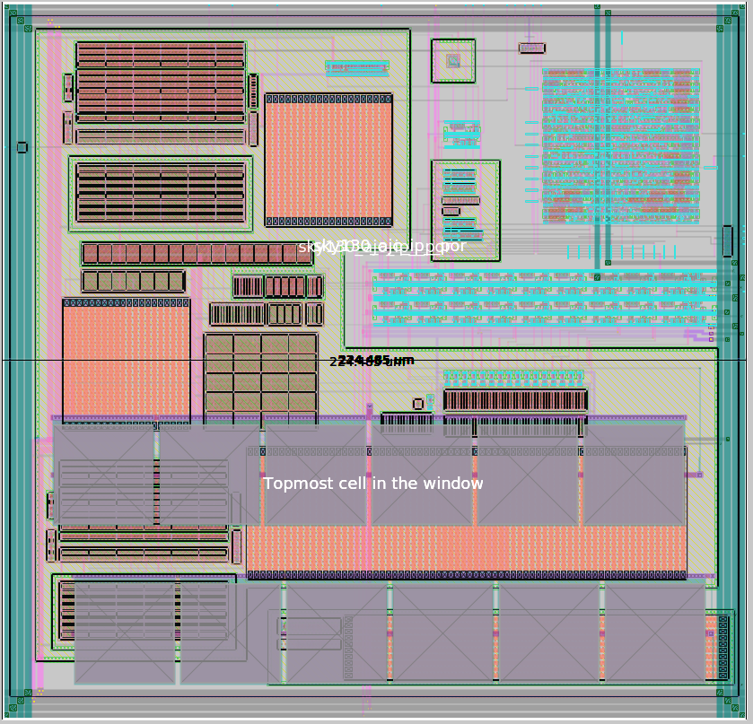

# sky130_ajc_ip__por
Power-on-reset (POR) bandgap-type for SKY130

This circuit is designed to produce a reset signal for chip/system-wide reset at power-up or after a supply collapes and subsequently recovers.  A selectable trip voltage from 2.4V to 3.0V sets the voltage at which the power supply is considered good, after which a one-shot timer, roughly 1ms in duration, allows the supply to stabilize.  A the system wide reset signal `por` is then asserted, and a second one-shot timer times a nominally 50ms reset window. 

The reset signal comes in three flavors, each capable of driving a 20pF load, `por` (active high 1v8) `porb` (active low 1v8) and `porb_h` (active low 3v3).

The trip voltage is set via `otrip[2:0]`

To clone this repository:

`git clone https://github.com/ajcci/sky130_ajc_ip__por`

To view a schematic after cloning the repository:

```
cd sky130_ajc_ip__por
xschem cace/dccurrent_avdd.sch
```

Run CACE to see simulation results against a set of specifications:

`cace-gui`


Results from before layout started.


Demo of a supply ramp on `avdd` (orange), causing the `porb` (blue) to assert a reset.  The green trace is `osc_ck`, the internal clock that times the one-shot timer window.  Due to long simulation times, both one-shot timers are significantly shortened from 32 and 2048 cycles to 4 and 8 cycles, respectively, using a test mode.


## Mixed-signal design
This is a mixed-signal design so there is a digital component to it.  Digital circuits are designed using Verilog, compiled and simulated using Icarus Verilog, and viewed using GTKWave.  Location of the digital files are in the `verilog` directory.  Below is a screen capture of some signals of the testbench `sky130_ajc_ip__por_tb.v`.


Behavioral simulation of POR using Verilog

## Layout
The layout was drawn in Magic, so it is best viewed and edited in Magic.

Open layout using Magic by typing the following in the `mag` directory:

`magic -d XR -rcfile $PDK_ROOT/$PDK/libs.tech/magic/sky130A.magicrc sky130_ajc_ip__por.mag`

Alternatively, if using Klayout, in base directory, enter the following in the terminal:

`klayout -e gds/sky130_ajc_ip__por.gds`


Layout of `sky130_ajc_ip__por`, approximate size is 230um x 230um sq.


## Design-Rule-Check (DRC)
DRC is automatic in Magic.  Design passes all rules in Magic except the 'MV diffusion spacing rules'.  
However, according to Tim Edwards at eFabless Inc., these are not actual violations and are false positives, see picture below.


DRC rule violations that are false positives (not actual violations) related to 'MV diffusion spacing'


Check the design using Klayout sky130 DRC deck for consistency:
1. In the Magic Tcl interpreter, run `gds write sky130_ajc_ip__por.gds` to stream out a gds file from Magic.
2. Load `sky130_ajc_ip__por.gds` into Klayout by running `klayout sky130ajc_ip__por.gds`
3. Run sky130A DRC rule deck (assumes Klayout environment is already setup for sky130 pdk, not described here)


Output from Klayout showing no DRC rule violations (all green) for sky130A DRC runset


Some special 'manufacturing rules' are not checked in Magic, so a special 'mr' rule deck in Klayout is used to check for those violations.  Simply load the `sky130A_mr` DRC deck and run to produce the all-pass result pictured below:


Output from Klayout showing no DRC rule violations for sky130A 'mr' DRC rules


## Layout vs Schematic (LVS)
Run using Magic for layout-to-spice netlist extraction, and then Netgen for netlist comparison vs schematic.

Steps taken to perform LVS:

1. Created a blackbox for the digital block `por_dig` and replaced the xspice model of `por_dig` with the blackbox `por_dig`.  In the symbol `por_dig.sym`, set `type=primitive`, so that when netlisting out, por_dig will be instantiated but not defined (i.e. no `subckt por_dig` is writting out).  This is important later for the Verilog gate-level netlist of por_dig to properly define the definition for por_dig.  Save the new top-level schematic as `sky130_ajc_ip__por_lvs`.  Netlist out `sky130_ajc_ip__por_lvs` in xschem and rename the netlist as `sky130_ajc_ip__por_lvs.xschem`.  Edit `sky130_ajc_ip__por_lvs.xschem` and add the following lines to the file (change $PDK_ROOT/$PDK to the location of your setup):

```
.include $PDK_ROOT/$PDK/libs.ref/sky130_fd_sc_hvl/spice/sky130_fd_sc_hvl.spice
```

2. Manually delete the bulk node 'avss' connection of the pnp device in the xschem netlist `sky130_ajc_ip__por_lvs.xschem`.

Search for this line in the file:
`XQ1 avss avss net8 avss sky130_fd_pr__pnp_05v5_W0p68L0p68 m=1 mult=1`

and change it to the following:

`XQ1 avss avss net8 sky130_fd_pr__pnp_05v5_W0p68L0p68 m=1 mult=1`

This step is necessary because the 'combined' models of the sky130 pdk uses a 4-port connection to sky130_fd_pr__pnp_05v5_W0p68L0p68, but Magic only extracts 3 ports, so we manually delete the bulk node (4th port).

3. Extract the layout in Magic using the following commands in the Tcl interpreter:

```
extract all
ext2spice lvs
ext2spice
```

Magic should generate a file named `sky130_ajc_ip__por.spice`

4. Locate the final gate-level Verilog netlist of por_dig.  In this case, it is located at

`openlane/por_dig/runs/RUN_2024-04-04_12-54-32/46-openroad-fillinsertion/por_dig.pnl.v`

5. Put the files `sky130_ajc_ip__por.spice` (Magic-extracted netlist), `sky130_ajc_ip__por_lvs.xschem` (xschem netlist), and `por_dig.pnl.v` in the same directory, in this case `mag/lvs`.

6. Create a new run script for Netgen, in this case called `runlvs`, and put the following contents inside:

```
set layout [readnet spice "sky130_ajc_ip__por.spice"]
set source [readnet spice "$env(PDK_ROOT)/$env(PDK)/libs.ref/sky130_fd_sc_hd/spice/sky130_fd_sc_hd.spice"]
readnet verilog por_dig.pnl.v $source
readnet spice "sky130_ajc_ip__por_lvs.xschem" $source
lvs "$layout sky130_ajc_ip__por" "$source sky130_ajc_ip__por_lvs" $env(PDK_ROOT)/$env(PDK)/libs.tech/netgen/$env(PDK)_setup.tcl lvs.report
```

7. Enter the following in the terminal to run LVS:

`netgen -batch source runlvs`

Netgen should produce the following output:

```
Contents of circuit 1:  Circuit: 'sky130_ajc_ip__por'
Circuit sky130_ajc_ip__por contains 170 device instances.
  Class: sky130_fd_pr__cap_mim_m3_2 instances:   1
  Class: sky130_fd_sc_hd__inv_4 instances:   5
  Class: sky130_fd_pr__pnp_05v5_W0p68L0p68 instances:   1
  Class: por_dig               instances:   1
  Class: schmitt_trigger       instances:   1
  Class: sky130_fd_sc_hvl__lsbufhv2lv_1 instances:   2
  Class: sky130_fd_pr__nfet_g5v0d10v5 instances:  59
  Class: sky130_fd_sc_hvl__inv_1 instances:  18
  Class: sky130_fd_sc_hvl__inv_4 instances:   1
  Class: sky130_fd_sc_hd__inv_16 instances:   4
  Class: sky130_fd_sc_hvl__lsbuflv2hv_1 instances:  19
  Class: sky130_fd_sc_hvl__inv_16 instances:   1
  Class: sky130_fd_pr__res_xhigh_po_1p41 instances:  10
  Class: sky130_fd_pr__pfet_g5v0d10v5 instances:  45
  Class: ibias_gen             instances:   1
  Class: rc_osc                instances:   1
Circuit contains 113 nets.
Contents of circuit 2:  Circuit: 'sky130_ajc_ip__por_lvs'
Circuit sky130_ajc_ip__por_lvs contains 170 device instances.
  Class: sky130_fd_pr__cap_mim_m3_2 instances:   1
  Class: sky130_fd_sc_hd__inv_4 instances:   5
  Class: sky130_fd_pr__pnp_05v5_W0p68L0p68 instances:   1
  Class: por_dig               instances:   1
  Class: schmitt_trigger       instances:   1
  Class: sky130_fd_sc_hvl__lsbufhv2lv_1 instances:   2
  Class: sky130_fd_pr__nfet_g5v0d10v5 instances:  59
  Class: sky130_fd_sc_hvl__inv_1 instances:  18
  Class: sky130_fd_sc_hvl__inv_4 instances:   1
  Class: sky130_fd_sc_hd__inv_16 instances:   4
  Class: sky130_fd_sc_hvl__lsbuflv2hv_1 instances:  19
  Class: sky130_fd_sc_hvl__inv_16 instances:   1
  Class: sky130_fd_pr__res_xhigh_po_1p41 instances:  10
  Class: sky130_fd_pr__pfet_g5v0d10v5 instances:  45
  Class: ibias_gen             instances:   1
  Class: rc_osc                instances:   1
Circuit contains 118 nets.

Circuit 1 contains 170 devices, Circuit 2 contains 170 devices.
Circuit 1 contains 113 nets,    Circuit 2 contains 113 nets.


Final result: 
Circuits match uniquely.
.
Logging to file "lvs.report" disabled
LVS Done.

```

8. Optional step to check the file `lvs.report` shows that the Verilog gate-level netlist, which defines por_dig was indeed included in the LVS check:

```
Subcircuit summary:
Circuit 1: por_ana                         |Circuit 2: por_ana                         
-------------------------------------------|-------------------------------------------
sky130_fd_sc_hd__inv_16 (4)                |sky130_fd_sc_hd__inv_16 (4)                
sky130_fd_sc_hvl__lsbufhv2lv_1 (2)         |sky130_fd_sc_hvl__lsbufhv2lv_1 (2)         
sky130_fd_pr__nfet_g5v0d10v5 (186->49)     |sky130_fd_pr__nfet_g5v0d10v5 (186->49)     
sky130_fd_pr__pfet_g5v0d10v5 (223->45)     |sky130_fd_pr__pfet_g5v0d10v5 (223->45)     
sky130_fd_sc_hvl__inv_1 (18)               |sky130_fd_sc_hvl__inv_1 (18)               
sky130_fd_pr__res_xhigh_po_1p41 (29->10)   |sky130_fd_pr__res_xhigh_po_1p41 (10)       
sky130_fd_sc_hvl__inv_4 (1)                |sky130_fd_sc_hvl__inv_4 (1)                
sky130_fd_sc_hd__inv_4 (5)                 |sky130_fd_sc_hd__inv_4 (5)                 
schmitt_trigger (1)                        |schmitt_trigger (1)                        
sky130_fd_sc_hvl__lsbuflv2hv_1 (19)        |sky130_fd_sc_hvl__lsbuflv2hv_1 (19)        
rc_osc (1)                                 |rc_osc (1)                                 
sky130_fd_sc_hvl__inv_16 (1)               |sky130_fd_sc_hvl__inv_16 (1)               
sky130_fd_pr__cap_mim_m3_2 (6->1)          |sky130_fd_pr__cap_mim_m3_2 (6->1)          
ibias_gen (1)                              |ibias_gen (1)                              
sky130_fd_pr__pnp_05v5_W0p68L0p68 (1)      |sky130_fd_pr__pnp_05v5_W0p68L0p68 (1)      
Number of devices: 159                     |Number of devices: 159                     
Number of nets: 104                        |Number of nets: 104                        
---------------------------------------------------------------------------------------
Netlists match uniquely with port errors.

Subcircuit pins:
Circuit 1: por_ana                         |Circuit 2: por_ana                         
-------------------------------------------|-------------------------------------------
comparator_1/vt                            |(no matching pin)                          
comparator_0/vt                            |(no matching pin)                          
avss                                       |avss                                       
vin                                        |vin                                        
avdd                                       |avdd                                       
vbg_1v2                                    |vbg_1v2                                    
por_unbuf                                  |por_unbuf                                  
otrip_decoded[7]                           |otrip_decoded[7]                           
otrip_decoded[6]                           |otrip_decoded[6]                           
otrip_decoded[5]                           |otrip_decoded[5]                           
otrip_decoded[4]                           |otrip_decoded[4]                           
otrip_decoded[3]                           |otrip_decoded[3]                           
otrip_decoded[2]                           |otrip_decoded[2]                           
otrip_decoded[1]                           |otrip_decoded[1]                           
otrip_decoded[0]                           |otrip_decoded[0]                           
force_pdnb                                 |force_pdnb                                 
isrc_sel                                   |isrc_sel                                   
itest                                      |itest                                      
ibg_200n                                   |ibg_200n                                   
osc_ck                                     |osc_ck                                     
osc_ena                                    |osc_ena                                    
porb_h                                     |porb_h                                     
porb                                       |porb                                       
pwup_filt                                  |pwup_filt                                  
por                                        |por                                        
dcomp                                      |dcomp                                      
dvdd                                       |dvdd                                       
dvss                                       |dvss                                       
comparator_0/vt                            |(no matching pin)                          
comparator_1/vt                            |(no matching pin)                          
---------------------------------------------------------------------------------------
Cell pin lists for por_ana and por_ana altered to match.
Device classes por_ana and por_ana are equivalent.
  Flattening non-matched subcircuits por_ana por_ana
Flattening unmatched subcell sky130_fd_sc_hd__tapvpwrvgnd_1 in circuit por_dig (1)(28 instances)
Flattening unmatched subcell sky130_fd_sc_hd__fill_2 in circuit por_dig (1)(27 instances)
Flattening unmatched subcell sky130_fd_sc_hd__fill_1 in circuit por_dig (1)(29 instances)

Class por_dig (0):  Merged 87 parallel devices.
Class por_dig (1):  Merged 87 parallel devices.
Subcircuit summary:
Circuit 1: por_dig                         |Circuit 2: por_dig                         
-------------------------------------------|-------------------------------------------
sky130_fd_sc_hd__decap_4 (8->1)            |sky130_fd_sc_hd__decap_4 (8->1)            
sky130_fd_sc_hd__decap_3 (46->1)           |sky130_fd_sc_hd__decap_3 (46->1)           
sky130_fd_sc_hd__dfrtp_1 (19)              |sky130_fd_sc_hd__dfrtp_1 (19)              
sky130_fd_sc_hd__nor3b_1 (3)               |sky130_fd_sc_hd__nor3b_1 (3)               
sky130_fd_sc_hd__buf_2 (16)                |sky130_fd_sc_hd__buf_2 (16)                
sky130_fd_sc_hd__nor3_1 (1)                |sky130_fd_sc_hd__nor3_1 (1)                
sky130_ef_sc_hd__decap_12 (23->1)          |sky130_ef_sc_hd__decap_12 (23->1)          
sky130_fd_sc_hd__inv_2 (5)                 |sky130_fd_sc_hd__inv_2 (5)                 
sky130_fd_sc_hd__dlygate4sd3_1 (15)        |sky130_fd_sc_hd__dlygate4sd3_1 (15)        
sky130_fd_sc_hd__xor2_1 (4)                |sky130_fd_sc_hd__xor2_1 (4)                
sky130_fd_sc_hd__and2b_1 (2)               |sky130_fd_sc_hd__and2b_1 (2)               
sky130_fd_sc_hd__a41o_1 (2)                |sky130_fd_sc_hd__a41o_1 (2)                
sky130_fd_sc_hd__decap_6 (7->1)            |sky130_fd_sc_hd__decap_6 (7->1)            
sky130_fd_sc_hd__decap_8 (8->1)            |sky130_fd_sc_hd__decap_8 (8->1)            
sky130_fd_sc_hd__and2_1 (4)                |sky130_fd_sc_hd__and2_1 (4)                
sky130_fd_sc_hd__a21oi_1 (2)               |sky130_fd_sc_hd__a21oi_1 (2)               
sky130_fd_sc_hd__o32a_1 (1)                |sky130_fd_sc_hd__o32a_1 (1)                
sky130_fd_sc_hd__nand2_1 (2)               |sky130_fd_sc_hd__nand2_1 (2)               
sky130_fd_sc_hd__o311a_1 (1)               |sky130_fd_sc_hd__o311a_1 (1)               
sky130_fd_sc_hd__o21ba_1 (2)               |sky130_fd_sc_hd__o21ba_1 (2)               
sky130_fd_sc_hd__o21ai_1 (1)               |sky130_fd_sc_hd__o21ai_1 (1)               
sky130_fd_sc_hd__o211a_1 (3)               |sky130_fd_sc_hd__o211a_1 (3)               
sky130_fd_sc_hd__o21bai_1 (2)              |sky130_fd_sc_hd__o21bai_1 (2)              
sky130_fd_sc_hd__and4_1 (4)                |sky130_fd_sc_hd__and4_1 (4)                
sky130_fd_sc_hd__and3_1 (3)                |sky130_fd_sc_hd__and3_1 (3)                
sky130_fd_sc_hd__clkbuf_1 (3)              |sky130_fd_sc_hd__clkbuf_1 (3)              
sky130_fd_sc_hd__or4bb_1 (1)               |sky130_fd_sc_hd__or4bb_1 (1)               
sky130_fd_sc_hd__clkbuf_4 (1)              |sky130_fd_sc_hd__clkbuf_4 (1)              
sky130_fd_sc_hd__a32o_1 (1)                |sky130_fd_sc_hd__a32o_1 (1)                
sky130_fd_sc_hd__a211oi_1 (1)              |sky130_fd_sc_hd__a211oi_1 (1)              
sky130_fd_sc_hd__buf_1 (2)                 |sky130_fd_sc_hd__buf_1 (2)                 
sky130_fd_sc_hd__or4b_1 (1)                |sky130_fd_sc_hd__or4b_1 (1)                
sky130_fd_sc_hd__conb_1 (1)                |sky130_fd_sc_hd__conb_1 (1)                
sky130_fd_sc_hd__clkbuf_2 (1)              |sky130_fd_sc_hd__clkbuf_2 (1)              
sky130_fd_sc_hd__dlymetal6s2s_1 (3)        |sky130_fd_sc_hd__dlymetal6s2s_1 (3)        
sky130_fd_sc_hd__or3b_1 (2)                |sky130_fd_sc_hd__or3b_1 (2)                
sky130_fd_sc_hd__nand2_2 (1)               |sky130_fd_sc_hd__nand2_2 (1)               
sky130_fd_sc_hd__and3b_1 (5)               |sky130_fd_sc_hd__and3b_1 (5)               
sky130_fd_sc_hd__clkbuf_16 (3)             |sky130_fd_sc_hd__clkbuf_16 (3)             
sky130_fd_sc_hd__and4bb_1 (1)              |sky130_fd_sc_hd__and4bb_1 (1)              
sky130_fd_sc_hd__a22o_1 (1)                |sky130_fd_sc_hd__a22o_1 (1)                
sky130_fd_sc_hd__o2bb2a_1 (2)              |sky130_fd_sc_hd__o2bb2a_1 (2)              
sky130_fd_sc_hd__or2_1 (2)                 |sky130_fd_sc_hd__or2_1 (2)                 
sky130_fd_sc_hd__a31o_1 (1)                |sky130_fd_sc_hd__a31o_1 (1)                
sky130_fd_sc_hd__mux2_1 (1)                |sky130_fd_sc_hd__mux2_1 (1)                
sky130_fd_sc_hd__nor2_1 (1)                |sky130_fd_sc_hd__nor2_1 (1)                
Number of devices: 132                     |Number of devices: 132                     
Number of nets: 139                        |Number of nets: 139                        
---------------------------------------------------------------------------------------
Netlists match uniquely.

Subcircuit pins:
Circuit 1: por_dig                         |Circuit 2: por_dig                         
-------------------------------------------|-------------------------------------------
osc_ck                                     |osc_ck                                     
force_ena_rc_osc                           |force_ena_rc_osc                           
force_dis_rc_osc                           |force_dis_rc_osc                           
force_pdn                                  |force_pdn                                  
force_short_oneshot                        |force_short_oneshot                        
otrip[2]                                   |otrip[2]                                   
otrip[1]                                   |otrip[1]                                   
otrip[0]                                   |otrip[0]                                   
pwup_filt                                  |pwup_filt                                  
por_timed_out                              |por_timed_out                              
otrip_decoded[7]                           |otrip_decoded[7]                           
otrip_decoded[3]                           |otrip_decoded[3]                           
otrip_decoded[5]                           |otrip_decoded[5]                           
otrip_decoded[6]                           |otrip_decoded[6]                           
otrip_decoded[1]                           |otrip_decoded[1]                           
otrip_decoded[2]                           |otrip_decoded[2]                           
otrip_decoded[4]                           |otrip_decoded[4]                           
force_pdnb                                 |force_pdnb                                 
otrip_decoded[0]                           |otrip_decoded[0]                           
osc_ena                                    |osc_ena                                    
por_unbuf                                  |por_unbuf                                  
startup_timed_out                          |startup_timed_out                          
VGND                                       |VGND                                       
VPWR                                       |VPWR                                       
---------------------------------------------------------------------------------------
Cell pin lists are equivalent.
Device classes por_dig and por_dig are equivalent.
Flattening unmatched subcell sky130_fd_pr__nfet_g5v0d10v5_RBNV2H in circuit sky130_ajc_ip__por (0)(1 instance)
Flattening unmatched subcell sky130_fd_pr__nfet_g5v0d10v5_X6E435 in circuit sky130_ajc_ip__por (0)(1 instance)
Flattening unmatched subcell sky130_fd_pr__nfet_g5v0d10v5_MUZ6AA in circuit sky130_ajc_ip__por (0)(1 instance)

Class sky130_ajc_ip__por (0):  Merged 10 parallel devices.
Subcircuit summary:
Circuit 1: sky130_ajc_ip__por              |Circuit 2: sky130_ajc_ip__por_lvs          
-------------------------------------------|-------------------------------------------
sky130_fd_pr__nfet_g5v0d10v5 (206->59)     |sky130_fd_pr__nfet_g5v0d10v5 (206->59)     
sky130_fd_sc_hd__inv_16 (4)                |sky130_fd_sc_hd__inv_16 (4)                
sky130_fd_sc_hvl__lsbufhv2lv_1 (2)         |sky130_fd_sc_hvl__lsbufhv2lv_1 (2)         
sky130_fd_pr__pfet_g5v0d10v5 (223->45)     |sky130_fd_pr__pfet_g5v0d10v5 (223->45)     
sky130_fd_sc_hvl__inv_1 (18)               |sky130_fd_sc_hvl__inv_1 (18)               
sky130_fd_pr__res_xhigh_po_1p41 (10)       |sky130_fd_pr__res_xhigh_po_1p41 (10)       
sky130_fd_sc_hvl__inv_4 (1)                |sky130_fd_sc_hvl__inv_4 (1)                
sky130_fd_sc_hd__inv_4 (5)                 |sky130_fd_sc_hd__inv_4 (5)                 
schmitt_trigger (1)                        |schmitt_trigger (1)                        
sky130_fd_sc_hvl__lsbuflv2hv_1 (19)        |sky130_fd_sc_hvl__lsbuflv2hv_1 (19)        
rc_osc (1)                                 |rc_osc (1)                                 
sky130_fd_sc_hvl__inv_16 (1)               |sky130_fd_sc_hvl__inv_16 (1)               
sky130_fd_pr__cap_mim_m3_2 (6->1)          |sky130_fd_pr__cap_mim_m3_2 (6->1)          
ibias_gen (1)                              |ibias_gen (1)                              
sky130_fd_pr__pnp_05v5_W0p68L0p68 (1)      |sky130_fd_pr__pnp_05v5_W0p68L0p68 (1)      
por_dig (1)                                |por_dig (1)                                
Number of devices: 170                     |Number of devices: 170                     
Number of nets: 113                        |Number of nets: 113                        
---------------------------------------------------------------------------------------
Netlists match uniquely.

Subcircuit pins:
Circuit 1: sky130_ajc_ip__por              |Circuit 2: sky130_ajc_ip__por_lvs          
-------------------------------------------|-------------------------------------------
dvdd                                       |dvdd                                       
avss                                       |avss                                       
avdd                                       |avdd                                       
vin                                        |vin                                        
itest                                      |itest                                      
ibg_200n                                   |ibg_200n                                   
porb_h                                     |porb_h                                     
porb                                       |porb                                       
por                                        |por                                        
dcomp                                      |dcomp                                      
por_timed_out                              |por_timed_out                              
startup_timed_out                          |startup_timed_out                          
vbg_1v2                                    |vbg_1v2                                    
isrc_sel                                   |isrc_sel                                   
pwup_filt                                  |pwup_filt                                  
osc_ck                                     |osc_ck                                     
force_dis_rc_osc                           |force_dis_rc_osc                           
force_ena_rc_osc                           |force_ena_rc_osc                           
force_pdn                                  |force_pdn                                  
force_short_oneshot                        |force_short_oneshot                        
otrip[2]                                   |otrip[2]                                   
otrip[1]                                   |otrip[1]                                   
otrip[0]                                   |otrip[0]                                   
dvss                                       |dvss                                       
---------------------------------------------------------------------------------------
Cell pin lists are equivalent.
Device classes sky130_ajc_ip__por and sky130_ajc_ip__por_lvs are equivalent.

Final result: Circuits match uniquely.
.

```
Last part of lvs.report showing LVS match as well as Verilog gate-level netlist (which defines `por_dig`)  being included in the check.


## Parasitic Resistance and Capacitance Extraction (RCX)
Perform RCX using Magic after passing DRC and LVS.  The purpose is to check how parasitics (interconnect resistance and capacitance) from layout affects the circuit.

This circuit includes a digital route which is not included in RCX because we will rely on Openlane to make sure timing is done correctly in the digital route.  
Therefore, only the analog section of the circuit is extracted.

Open up `por_ana.mag` (analog section of `sky130_ajc_ip__por`) and enter the following in the Tcl interpreter to generate an extracted spice netlist with parasitic resistance 
and capacitance included in the netlist:

```
flatten por_ana_rcx
load por_ana_rcx
select top cell
extract path extfiles
extract all
ln -s extfiles/por_ana_rcx.ext (enter this line in terminal)
ext2sim labels on
ext2sim
extresist tolerance 0.001
extresist
ext2spice lvs
ext2spice cthresh 0.1
ext2spice extresist on
ext2spice -p extfiles
```
A netlist should be created named `por_ana_rcx.spice`, which has a top-level subckt named `por_ana_rcx`.  Create the directory `mag/rcx` and put `por_ana_rcx.spice` in there.  

As a side note, `extresist tolerance 0.001` was used here to reduce the number of nodes created by the extraction algorithm, which created convergence problems for Ngspice 
later during simulation.  Changing `extresist tolerance 10` to `extresist tolerance 0.001`, for this circuit, roughly reduced the number of nodes by 30%.

In order to use `por_ana_rcx` in a simulation, do the following:
1. Create a blackbox schematic named `por_ana_rcx` with all the associated pins and pin-order exactly the same as `por_ana.sym`
2. Create an accompanying symbol named `por_ana_rcx.sym`
3. Within the schematic `por_ana_rcx.sch`, add a `devices/code.sym` block from the xschem library
4. In the `code.sym` block, instantiate `por_ana_rcx` and include the extracted netlist subckt definition (in this case it is located at `mag/rcx/por_ana_rcx.spice`):

```
name=por_ana only_toplevel=false value="

.include mag/rcx/por_ana_rcx.spice

xIana otrip_decoded[14] otrip_decoded[13] otrip_decoded[11]
+ otrip_decoded[10] otrip_decoded[1] otrip_decoded[0] ena itest ibg_200n otrip_decoded[7]
+ otrip_decoded[4] vbg_1v2 vin isrc_sel otrip_decoded[5] otrip_decoded[8] otrip_decoded[2]
+ ovout otrip_decoded[15] otrip_decoded[9] otrip_decoded[12] otrip_decoded[3] otrip_decoded[6]
+ avss dvdd dvss avdd por_ana_rcx
"
```

Open up `sky130_ajc_ip__por` and substitute `por_ana.sym` with `por_ana_rcx.sym` (see pictures below):


Original `sky130_ajc_ip__por` showing `por_ana` (schematic-based, no RC parasitics)


New `sky130_ajc_ip__por` showing `por_ana_rcx` (extracted from layout, with RC parasitics)

Save it and run CACE the usual way __without__ selecting `R-C Extracted` from the `cace-gui` window.  Once again, this is done because this circuit uses xspice models to simulate the behavior 
of the digital route and the digital route was not extracted from the layout for faster simulation (as well as a higher likelihood of simulation convergence).

Without any changes to Ngspice parameters, the extracted netlist will run into __'Timestep too small'__ issues due to limitations of the simulator, and cause the simulation to quit prematurely.

To make it run all the way through, add the following two options to reduce the tolerance of the simulation, albeit reduces accuracy of the simulation results:

```
.option reltol=1e-3
.option abstol=1e-3
```

The result after RCX simulation is shown in the figure below. All pass.

RCX netlist with .options reltol=1e-3 abstol=1e-3

For comparison, run the same simulation with relaxed tolerances using the schematic. All pass.  It should be noted that after the initial design (above), during the layout phase 
the design was changed to re-center the timing against the spec.


Schematic netlist with .options reltol=1e-3 abstol=1e-3

### Digital Route DRC & LVS
DRC and LVS is performed by Openlane during synthesis.  It performs LVS by extracting the digital route using Magic, and then comparing it to the verilog file generated after fill-insersion.  Here is the result:


### Simulation convergence issues
During the design phase it was discovered that the resistor string made up of xhigh_po resistors (2kohm/sq) confuses Ngspice when too many of them are in series.  There are a total of 70 resistors in the resistor ladder, and each resistor models second-order effects related to the substrate using hyperbolic-tangent functions (shown below).  Manually removing the `tanh` model and substuiting back in a basic resistor solves the convergence issues during simulation.  This is not seen as a risk as this is not a precision circuit.

```
rbody t1 t2 resbody r = {rbody*(1-bp2+bp2*sqrt(1+(bq2*abs(v(t1,t2))*Efac)**2))*
+ (sub1+sub2*tanh(sub3*(min(v(sub,r1)+v(sub,r1),sub4)+sub5))) / (sub1+sub2*tanh(sub3*sub5)) }
```

The above excerpt can be located at
`$PDK_ROOT/$PDK/libs.tech/combined/continuous/models_resistors.spice`

Replacing the above definition of `rbody` with the following, eliminates convergence or simulator-going-haywire >
```
rbody t1 t2 resbody r = rbody
```

Note that `resbody` is a model that defines tempco so the model retains tempo variations.
